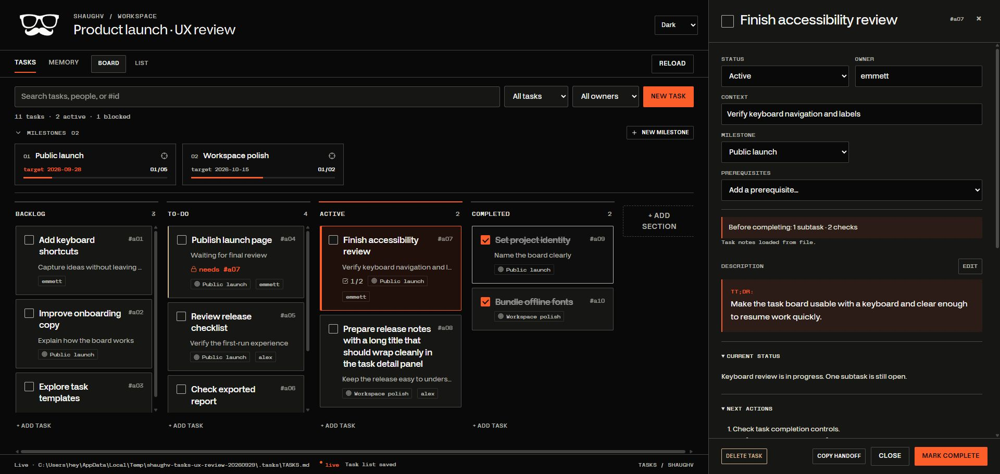

# Workspace refinement — September 2026

The pass focuses on finding the next useful action, keeping editing predictable, and
resuming work across Codex and ChatGPT. The existing SHAUGHV type, colors, file formats,
and board-plus-detail design remain the foundation.

## Decisions and resulting behavior

| Friction | Change |
|---|---|
| Large queues require scanning columns | Search plus owner/status filters work in both layouts, with a result count and Clear filters. |
| Capture differs between Board and List | One New task composer, keyboard shortcuts, and a visible default status. |
| Dependencies require remembering IDs | Choose tasks by name, open existing prerequisites, prevent cycles in the picker, and flag missing IDs. |
| Completion controls are easy to miss | Explicit Mark complete/Reopen actions and a summary of remaining checks. |
| A column move can imply unverified completion | Moving toward Completed opens the verification flow; successful completion moves the task in the guarded save. |
| Completion hides useful reading controls | Lock mutations while leaving records and disclosures readable. |
| Save messages disappear too quickly | Separate task-list and task-note status, persistent save failures, and retry. |
| Background records bury the next action | Current status, plan, and next actions appear ahead of supporting records. |
| ChatGPT lacks an explicit bridge | Copy handoff supplies a dated saved snapshot; the skill explains reconciliation with live project files. |
| Skill entry points load too much setup detail | Move setup, file formats, contracts, and extended scoping to linked references. |
| README reads like an implementation inventory | Lead with the benefit, show the app, then give Codex setup and everyday examples. |

## Visual and motion choices

Keep the border-led SHAUGHV workspace, Makira reading type, Gail Rock metadata, orange dark
appearance, and green light appearance. Use a smaller header, consistent spacing, clearer
blocked tasks, and one capture/filter row. A wide detail panel shares space with the board;
a narrow panel uses the full available screen and keeps its actions reachable.

Motion explains a local change: short control entrances, a small checkbox response, panel
entry/exit, and existing task-movement animation. Exit is quicker than entry. Shadows belong
to overlapping panels; the desktop side panel uses a border. Reduced-motion preferences
remove the CSS transitions and animations; the existing JavaScript motion preference listener
also responds to changes.

Material guidance supplied the spacing, hierarchy, and transition baseline; the interface
retains its own visual design. No spring animation engine or component framework was added.
References: [motion overview](https://m3.material.io/styles/motion/overview/how-it-works),
[easing and duration](https://m3.material.io/styles/motion/easing-and-duration/applying-easing-and-duration),
and [elevation](https://m3.material.io/styles/elevation/overview).

## Validation performed

All interactive changes were exercised against a disposable local board with fictional tasks.
The review used a separate preview; existing user boards were not upgraded during these checks.

- Search, combined owner/status filtering, no-match recovery, capture, and layout switching.
- Named prerequisite selection/removal and inspection of transitive-cycle exclusion.
- An open subtask and an open verification check each refused completion. Passing the demo
  check allowed completion into Completed; reopening returned the task to To-Do.
- Copy handoff included the saved custom Evidence receipts section and reconciliation note.
- Forced an offline task-list save failure, confirmed persistent error and retry, then saved
  successfully and reloaded the edited value from disk.
- Light and dark desktop layouts, a 1366 × 768 viewport, and a 390 × 844 mobile viewport.
  The mobile page and task panel stayed within the viewport width, with visible footer actions.
- Reduced-motion emulation produced a zero-duration control transition. Temporary browser
  emulation was cleared after the checks.
- Memory navigation, milestone capture entry/cancel, task focus return, and readable completed
  records. The accessibility tree exposes named property and checklist controls.
- Dashboard script parsing, Node syntax checks for server/hooks, valid JSON and skill metadata,
  relative Markdown link targets, version lockstep, generated package byte checks, and diff
  whitespace checks.
- Before publication, Codex CLI discovery confirmed the existing marketplace and installed
  1.2.0 snapshot. The generated 1.3.0 package passed the source and package checks above.

## Limits

This is a manual browser and source/package validation pass, not screen-reader certification
or physical mobile-device acceptance. A fresh marketplace install, skill-trigger qualification
in a new Codex/ChatGPT session, and the static file-picker fallback were not exercised.

Missing prerequisite IDs are now visible, but the existing dependency parser/server rules are
unchanged. Snapshot handoffs do not synchronize an ordinary ChatGPT conversation with the
local board. This report records the pre-release review; Git history and CI record publication.

